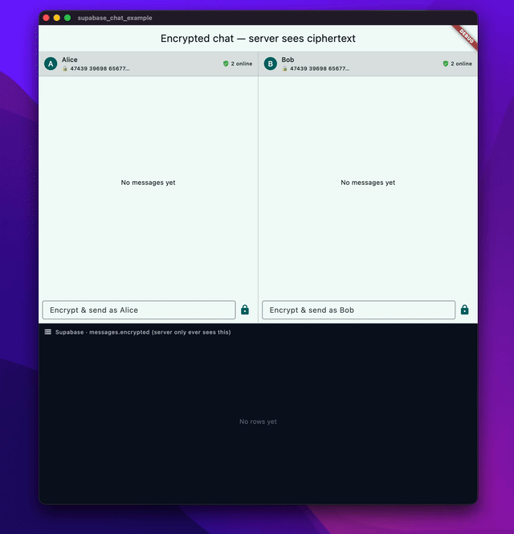

# supabase_realtime_kit

[](https://pub.dev/packages/supabase_realtime_kit)
[](https://pub.dev/packages/supabase_chat)
[](https://pub.dev/packages/supabase_chat_widgets)
[](https://pub.dev/packages/supabase_chat_seal)
[](https://pub.dev/packages/supabase_chat_e2ee)

**Realtime, done once — cleanly.** A monorepo of plug-and-play realtime
libraries for **Flutter & Dart** on top of [Supabase](https://supabase.com).

Build a live, optimistic, self-healing chat — or live cursors, dashboards, and
collaborative docs — without re-stitching `postgres_changes`, `broadcast`, and
`presence` by hand every single time. The core is **headless and pure Dart**;
chat is just its flagship consumer; and end-to-end encryption is one opt-in
package away.

```dart
final chat = SupabaseChat(supabaseClient);
final room = chat.room(roomId)..join();

ChatView(room: room); // 👈 a complete, live chat screen in Flutter
```

That's a real-time message list with optimistic send, typing indicators,
presence, reactions, replies, media, read receipts, reconnect backfill, **and**
an offline outbox — from three lines.

## Demo

Two users (Alice & Bob) chatting end-to-end encrypted side by side — note the
bottom panel showing the **ciphertext the Supabase server actually stores**,
while each client renders the decrypted text.



> Prefer full quality? [Watch the MP4](docs/media/demo.mp4).

## The packages

| Package | pub.dev | What it is | Layer |
|---|---|---|---|
| [`supabase_realtime_kit`](packages/supabase_realtime_kit) | [](https://pub.dev/packages/supabase_realtime_kit) | **Pure-Dart core.** Live queries with optimistic merge, presence, broadcast, reconnect reconciliation, and a pluggable offline outbox. | Foundation |
| [`supabase_chat`](packages/supabase_chat) | [](https://pub.dev/packages/supabase_chat) | **Chat domain** on the core: rooms, messages, typing, presence, reactions, replies, edits, media, read receipts. | Domain |
| [`supabase_chat_widgets`](packages/supabase_chat_widgets) | [](https://pub.dev/packages/supabase_chat_widgets) | **Optional Flutter widgets**: a drop-in `ChatView` + building blocks (`MessageBubble`, `MessageComposer`, `TypingIndicator`). | UI |
| [`supabase_chat_e2ee`](packages/supabase_chat_e2ee) | [](https://pub.dev/packages/supabase_chat_e2ee) | **Opt-in E2EE — Signal Protocol** (forward secrecy). The server stores only ciphertext. **GPL-3.0** (open-source apps). | Security |
| [`supabase_chat_seal`](packages/supabase_chat_seal) | [](https://pub.dev/packages/supabase_chat_seal) | **Opt-in E2EE — ECDH + AES-GCM** sealed box. Same verified-E2EE API, **MIT** licensed → **safe for closed-source apps** (no forward secrecy). | Security |
| [`example/`](example) | — | A runnable Flutter chat app wiring it all together. | — |
| [`e2e/`](e2e) | — | Real-instance end-to-end tests against a live Supabase project. | — |

The dependency arrow only ever points **down**: `ui`, `e2ee`, and `seal` build
on `chat`, which builds on the core. The core knows nothing about chat — live
cursors and dashboards reuse the exact same primitives.

> **Two E2EE options, by license.** `supabase_chat_e2ee` uses the Signal
> Protocol (forward secrecy) but is **GPL-3.0** — distributing it forces your
> app open-source. `supabase_chat_seal` is **MIT** (ECDH + AES-GCM, no forward
> secrecy) and is **safe for closed-source apps**. Same verified-E2EE API
> (`safetyNumber` / `markVerified` / strict mode); pick by your licensing.

## Why this exists

Raw Supabase realtime is powerful but low-level. Every app re-implements the
same plumbing and gets the edge cases wrong:

- 🔁 **Optimistic UI** — show a row instantly, then reconcile with the server
  echo *without duplicates*.
- 📡 **Reconnect backfill** — catch the changes you missed while offline when
  the socket comes back.
- 📦 **Offline outbox** — queue writes that fail offline and retry them on
  reconnect.
- 👀 **Presence + typing** — ephemeral signals over the wire, no DB writes.

This kit does all of that once, behind a small, predictable API.

## Quick start

**1. Backend** — apply the SQL migrations to your Supabase project (tables,
RLS policies, realtime publication):

```bash
# 0001 = chat schema · 0002 = E2EE key directory (only if you use supabase_chat_e2ee)
supabase db push   # or paste supabase/migrations/*.sql into the SQL editor
```

**2. Run the example app:**

```bash
dart pub global activate melos
melos bootstrap            # or: flutter pub get  (native pub workspace)
cd example
flutter run \
  --dart-define=SUPABASE_URL=https://YOUR.supabase.co \
  --dart-define=SUPABASE_ANON_KEY=YOUR_ANON_KEY
```

## Show me code

### 1 · The headless core — a live, optimistic list

Not just for chat. Any table → a self-healing stream.

```dart
import 'package:supabase_realtime_kit/supabase_realtime_kit.dart';

final kit = RealtimeKit(supabaseClient);

// Initial REST load + live postgres_changes tail + optimistic merge, one stream.
final messages = kit.liveQuery<Map<String, dynamic>>(
  table: 'messages',
  fromJson: (row) => row,
  idOf: (row) => row['id'] as String,
  compare: (a, b) =>
      (a['created_at'] as String).compareTo(b['created_at'] as String),
);

messages.stream.listen((rows) => render(rows)); // re-renders on every change
await messages.start();

// Optimistic insert: shows immediately, reconciles with the echo,
// and is buffered in the outbox + retried if you're offline.
await kit.insert(
  table: 'messages',
  payload: {'body': 'hello realtime'},
  outboxId: 'client-generated-id',
);
```

### 2 · The chat domain — rooms, messages, presence

```dart
import 'package:supabase_chat/supabase_chat.dart';

final chat = SupabaseChat(supabaseClient); // user must be signed in

// 1:1 or group rooms, created/looked up idempotently.
final created = await chat.directRoom('the-other-user-id');
final room = switch (created) {
  Ok(:final value) => value,
  Err(:final error) => throw error,
};

room.messages.listen((messages) => render(messages));   // optimistic + live
room.typingUserIds.listen(showTyping);
room.presentUsers.listen(showOnline);
await room.join();

await room.send(text: 'hey 👋');             // renders instantly, no dupes
await room.setTyping(typing: true);          // typing indicator (no DB write)
await room.react(someMessageId, '👍');       // emoji reaction
await room.markRead();                       // read receipt + unread counts
await room.loadMore();                       // infinite-scroll history
```

### 3 · The UI — a screen in one widget

```dart
import 'package:supabase_chat_widgets/supabase_chat_widgets.dart';

Scaffold(
  appBar: AppBar(title: const Text('general')),
  body: ChatView(room: room), // joins on mount, leaves on dispose
);
```

Theming follows your app's `ColorScheme` — no hard-coded brand colors. Need a
custom layout? Compose `MessageBubble`, `MessageComposer`, and
`TypingIndicator` yourself.

### 4 · End-to-end encryption — the server sees only ciphertext 🔐

Wrap a room and the plaintext never leaves the device. Built on the Signal
Protocol (X3DH + Double Ratchet) with **safety-number verification** to defeat
a malicious server.

```dart
import 'package:supabase_chat_e2ee/supabase_chat_e2ee.dart';

final identity = await E2eeIdentity.generate();      // once per install
final manager = E2eeManager(
  identity: identity,
  directory: SupabasePreKeyDirectory(supabaseClient),
  currentUserId: myUserId,
);
await manager.publishOwnKeys();

final secure = EncryptedChatRoom(room, manager, recipientUserIds: [peerId]);
await secure.join();

// Strict mode (default): verify the peer before the first send.
final number = await secure.safetyNumber();  // same 60 digits on both devices
await secure.markVerified();                  // after the user confirms it
await secure.send('hello, end-to-end 🔐');     // server stores only ciphertext
```

**See it run with zero backend:**

```bash
dart run packages/supabase_chat_e2ee/example/e2ee_demo.dart
```

```
=== 3. Safety numbers (man-in-the-middle check) ===
  Alice computes: 05794 26793 94914 51015 06994 ...
  Bob computes:   05794 26793 94914 51015 06994 ...
  Identical on both sides? true  ✅
=== 6. What the Supabase server actually stores ===
  messages.encrypted -> {"bob":{"t":3,"b":"MwgBEiEFLFeq7OT/ZMGJ..."}}
  The server sees only this blob — no plaintext, ever.
=== 9. Tamper check: a swapped identity key is rejected ===
  Rejected as expected: IdentityChangedException ✅
```

## Architecture at a glance

```
   ┌──────────────────┬────────────────────┬────────────────────┐
   │ supabase_chat_widgets │ supabase_chat_e2ee │ supabase_chat_seal  │  opt-in
   │   (Flutter UI)   │  (Signal · GPL)    │  (ECDH+GCM · MIT)   │
   └────────┬─────────┴─────────┬──────────┴─────────┬───────────┘
            │                   │                    │
        ┌───┴───────────────────┴────────────────────┴───┐
        │                 supabase_chat                   │  chat domain (Dart)
        └─────────────────────┬───────────────────────────┘
                              │
        ┌─────────────────────┴───────────────────────────┐
        │             supabase_realtime_kit                │  realtime core (Dart)
        └─────────────────────┬───────────────────────────┘
                              │
                       package:supabase
```

## Develop

A native Dart pub workspace (Dart **3.10+**) managed with
[Melos](https://melos.invertase.dev):

```bash
melos run format     # dart format
melos run analyze    # strict very_good_analysis lints
melos run test       # unit tests (incl. a backend-free E2EE round-trip)
melos run check      # all of the above (pre-commit gate)
```

The optional `e2e/` package runs the chat flows against a real Supabase
project; see its README for the env vars it expects.

## Design principles

- **Thin over the SDK, no magic** — predictable wrappers, not a framework.
- **Result-first** — errors are returned (`Ok` / `Err`), not thrown across the API.
- **Pluggable, not bundled** — bring your own outbox/key persistence; nothing
  platform-specific (no Keychain, no secure-storage) baked into the core.
- **RLS is the security boundary** — the client trusts the policies shipped in
  the migrations.
- **Encryption is opt-in and honest** — `supabase_chat_e2ee` documents exactly
  what it does and does not protect.

## Licensing & compatibility

Four of the five packages are **MIT**, so the core, chat, UI, and the `seal`
E2EE option are safe in any app — closed-source included. The **one package to
watch is `supabase_chat_e2ee`**, which is **GPL-3.0** because it links a copyleft
dependency. The MIT UI package does **not** depend on it, so using the widgets
can't pull GPL into your app:

| Package | License | Notable deps | Safe in a closed-source app? |
|---|---|---|---|
| `supabase_realtime_kit` | MIT | `supabase` (MIT) | ✅ yes |
| `supabase_chat` | MIT | `supabase` (MIT) | ✅ yes |
| `supabase_chat_widgets` | MIT | Flutter (BSD) — **no crypto dep** | ✅ yes |
| `supabase_chat_seal` | MIT | `cryptography` (Apache-2.0), `crypto` (BSD-3) | ✅ **yes** |
| `supabase_chat_e2ee` | **GPL-3.0** | **`libsignal_protocol_dart` (GPL-3.0)** | ❌ **no** — GPL forces your whole app open-source |

**The rule:** if you want Signal-grade forward secrecy *and* your app is
GPL/open-source, use `supabase_chat_e2ee`. For **any closed-source or
proprietary app**, use `supabase_chat_seal` (same verified-E2EE API, MIT, no
forward secrecy). Don't ship `supabase_chat_e2ee` unless your project can
comply with GPL-3.0.

## License

MIT © Ranbir Singh — for every package **except** `supabase_chat_e2ee`, which is
**GPL-3.0** (it links the GPL `libsignal_protocol_dart`; that license governs any
app you distribute with it — see the table above).
